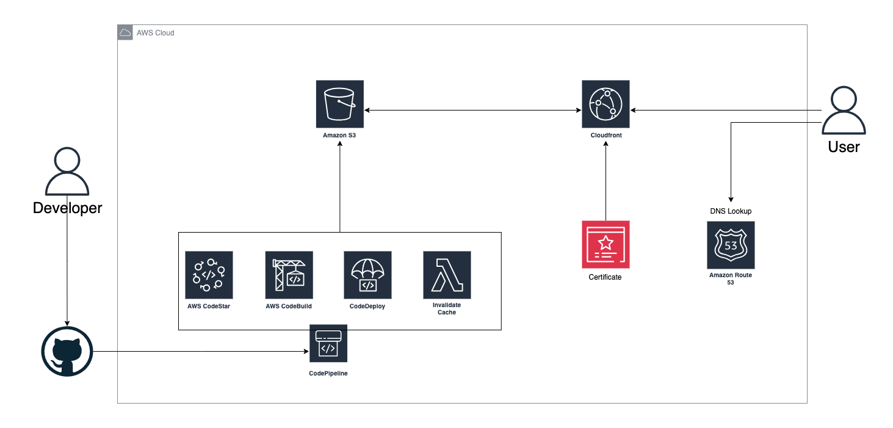

# Static Website

 

## Applications

- [Client](https://github.com/StellarScript/Static-Web-Terraform/tree/main/apps/client)
- [Terraform](https://github.com/StellarScript/Static-Web-Terraform/tree/main/apps/terraform/README.md)

 

### host static website on aws s3

  

 

## Instructions

### Export environmental variables

`TF_VAR_bucket_name` - Any name for bucket \
`TF_VAR_pipeline_name` - Any name for pipeline \
`TF_VAR_codebuild_name` - Any name for codebuild

 

`TF_VAR_codestart_connection` - Manually create codestart connection with github
`TF_VAR_repository_id` - github_organization/repository

 

`AWS_DEFAULT_REGION` - Aws region \
`AWS_ACCESS_KEY_ID` - Aws credential \
`AWS_SECRET_ACCESS_KEY` - Aws credential
